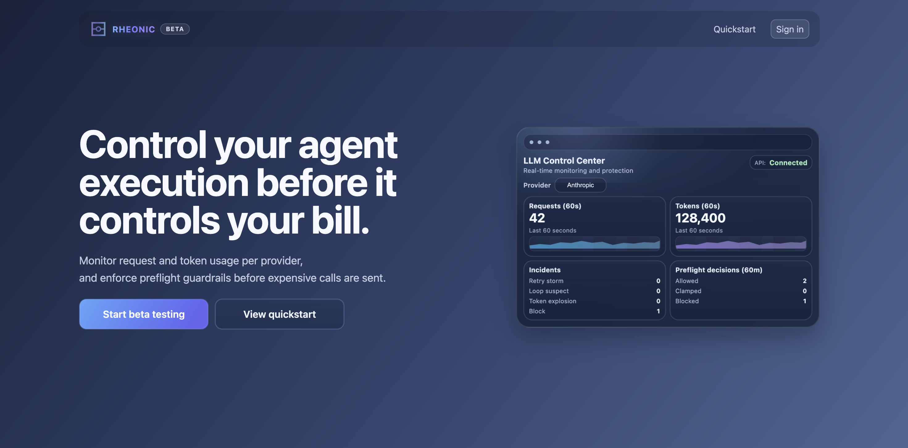
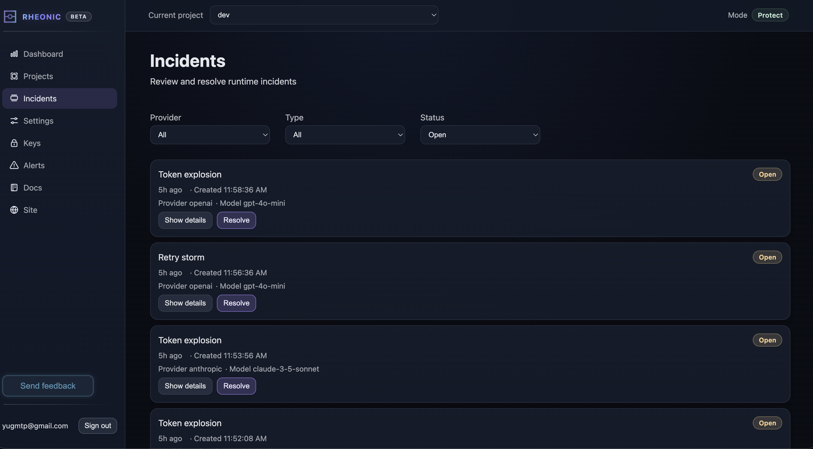
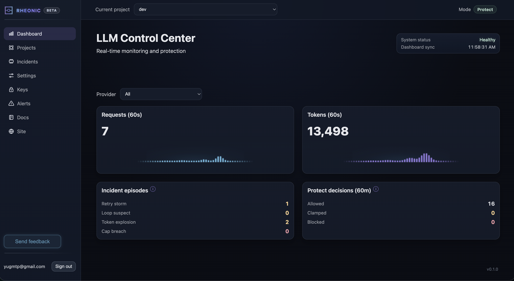

# Status: Development paused.

Rheonic was built as an LLM API layer for cost control and observability in agentic workflows.

The project is currently paused after initial validation attempts.
The system is fully functional, but did not reach product-market fit.
The hosted service is no longer active.

<p align="center">
  
</p>
<p align="center">
  
</p>
<p align="center">
  
</p>

# Rheonic

Rheonic is a runtime safety layer for LLM applications with:
- FastAPI backend
- PostgreSQL + Redis
- RQ worker + scheduler
- React/Vite frontend
- unified outbox-based transport hub for webhook + email delivery

## SDKs

- Node: https://www.npmjs.com/package/@rheonic/sdk
- Python: https://pypi.org/project/rheonic-sdk/

⚠️ Deprecated. No longer maintained.

## Local development
1. Start local stack through Doppler:
```bash
bash deploy/local_doppler.sh up -d --build
```
2. Verify:
```bash
curl -fsS http://localhost:8000/health
curl -fsS http://localhost:8000/ready
```

## Deployment docs
- Release: [`docs/RELEASE.md`](docs/RELEASE.md)
- Deploy: [`docs/deploy.md`](docs/deploy.md)
- SDK release: [`docs/sdk-release.md`](docs/sdk-release.md)
- Audit: [`docs/deploy-readiness-audit.md`](docs/deploy-readiness-audit.md)
- Legacy staging guide: [`docs/deploy-staging.md`](docs/deploy-staging.md)
- Legacy production guide: [`docs/deploy-production.md`](docs/deploy-production.md)
- Rollback details: [`docs/rollback.md`](docs/rollback.md)

## Transport notifications
- Notification catalog: [`docs/NOTIFICATION_CATALOG.md`](docs/NOTIFICATION_CATALOG.md)

## License
MIT
